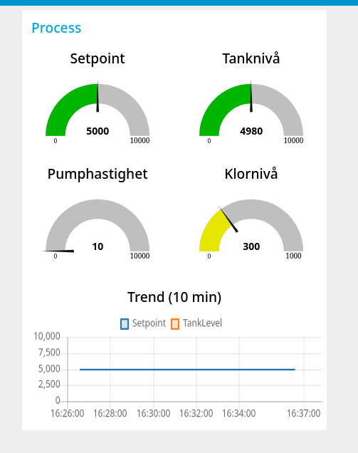
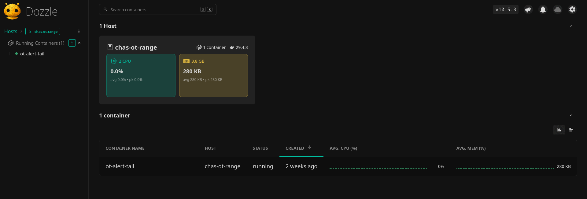

# ICS-arkitektur — Chas OT-range (snabbspår)

## Sammanfattning
En simulerad vattenreningsanläggning körs som en del av OT-range-tjänsten. HMI:n läser ett OpenPLC-system 1 gång per sekund via Modbus TCP och visar tanknivå, pumphastighet, klorhalt och larmstatus. Suricata övervakar trafiken mellan IT- och OT-segmenten och larmar på skrivoperationer.

## Komponenter
| Komponent      | Roll              | IP-adress     | Port  | Protokoll       |
|----------------|------------------|---------------|-------|-----------------|
| OpenPLC        | PLC runtime       | 10.0.50.10    | 502   | Modbus TCP      |
| OpenPLC web    | PLC konfiguration | 10.0.50.10    | 8080  | HTTP            |
| Node-RED HMI   | HMI/SCADA         | 10.0.50.20    | 1880  | HTTP / Modbus   |
| Suricata       | IDS               | host          | -     | sniffar br-ot   |
| Attacker       | angriparens host  | 10.0.10.99 / 10.0.50.99 | - | - |

## Nätverkssegmentering
- `br-ot` (10.0.50.0/24): PLC och HMI/SCADA.
- `br-it` (10.0.10.0/24): attacker- och företags-/IT-nät.
- HMI:n är dual-homed: den har åtkomst mot både IT och OT för att visa dashboarden och ta in operatörskommando via webben.
- Angriparhosten är också dual-homed med adress i både IT och OT, vilket ger en direkt nätverksväg till PLC:n.

## Modbus mapping
- HR0 (`%QW0`) = Setpoint
- HR1 (`%QW1`) = TankLevel
- HR2 (`%QW2`) = PumpSpeed
- HR3 (`%QW3`) = ChlorineLevel
- Coil 0 (`%QX0.0`) = DosingValve
- Coil 1 (`%QX0.1`) = Alarm

## Kommunikationsflöden
- HMI → PLC: FC3 (Read Holding Registers), startregister 0, quantity 4, polling 1 sekund.
- Normaldrift: inga Modbus skrivningar från HMI till PLC.
- Operatör → HMI: webbgränssnitt skyddat med basic auth.
- Suricata: övervakar trafik på OT-gränsen och larmar på Modbus-write-funktioner.

## Purdue-modellen — mappning
| Nivå | Roll | Vår motsvarighet |
|------|------|------------------|
| 0    | Fysisk process | Simulerad vattenrening |
| 1    | PLC / kontroller | OpenPLC |
| 2    | HMI / SCADA | Node-RED HMI |
| 3    | Site operations | Saknas |
| 4    | Företags-IT | Attacker-host / IT-nät |
| 5    | Internet | Saknas |

## Bilder
- 
- 
